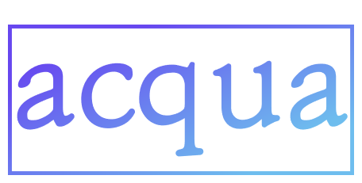

# acqua

Short for 'acquaintance', *acqua* is a service for managing your acquaintances. Never forget anything about your friends, coworkers, and family again; make memos on *acqua*, and it will remind you of your friends' details right before you meet them. Use the *acqua* calendar for additional functionality like schedule integration with your friends and reminders.

# acqua Android

Android client for *acqua*

Developed entirely in Kotlin

Libraries used:
- ReactiveX: RxKotlin, RxAndroid, RxBinding
- Android Architecture Components: ViewModel, LiveData
- HTTP Client: Retrofit2
- Databinding
- Anko

[Node.js REST API](https://github.com/etture/acqua-api)